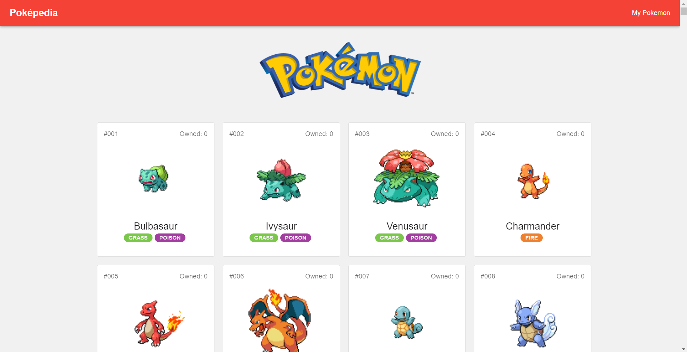

  <h3 align="center">Poképedia</h3>
  

    An Open Source Pokedex built with React & GraphQL
     
     
    <a href="https://pokepedia-graphql.netlify.app/">View Demo</a>
    ·
    <a href="https://github.com/timotius02/pokepedia/issues">Report Bug</a>
    ·
    <a href="https://github.com/timotius02/pokepedia/issues">Request Feature</a>
  

<!-- ABOUT THE PROJECT -->

## About The Project

### Built With

- [React.js](https://reactjs.org/)
- [PokeAPI GraphQL](https://github.com/mazipan/graphql-pokeapi)
- [Apollo Client](https://www.apollographql.com/)
- [Material UI](https://mui.com/)
- [Reach Router](https://reach.tech/router/)
- [Emotion CSS](https://emotion.sh/docs/introduction)
- [React-Window](https://github.com/bvaughn/react-window)

## Features

- List all 1000+ Pokemon
- Gives Stats & Moves of each pokemon
- Allows you to catch & release Pokemon locally

## TODO

- Intergrate Testing
- Improve Design

<!-- CONTACT -->

## Contact

Timotius Sitorus - [@timsitorus](https://twitter.com/timsitorus)
